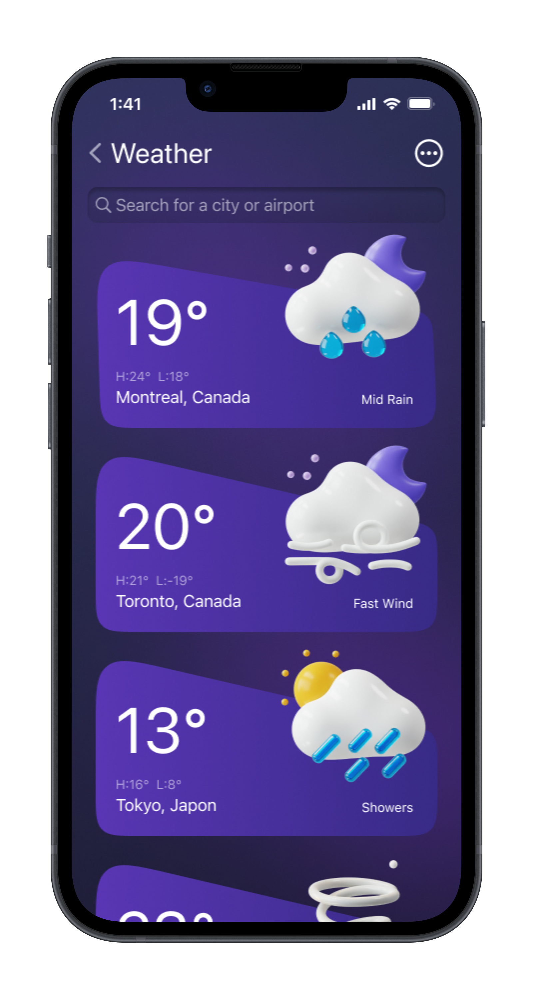

# Apple Weather App

A pixel-perfect recreation of the iOS Weather app, built with React Native and Expo. Custom-drawn gradients and shapes with Skia, fluid gesture-driven animations with Reanimated, and live forecast data from real weather APIs.

Based on this Figma design: [Weather App UI Design](https://www.figma.com/community/file/1100826294536456295/weather-app-ui-design)


## Demo

▶️ [Watch the video on Vimeo](https://vimeo.com/912956417)

<p float="left">
  
  
</p>

## Features

- **Custom drawing with Skia** — background gradients, the forecast sheet, and widget shapes are drawn with [react-native-skia](https://shopify.github.io/react-native-skia/)
- **Fluid animations** — gesture-driven transitions powered by [Reanimated 3](https://docs.swmansion.com/react-native-reanimated/)
- **Draggable forecast sheet** — built on [@gorhom/bottom-sheet](https://gorhom.dev/react-native-bottom-sheet/)
- **Blur effects** — iOS-style frosted glass via [expo-blur](https://docs.expo.dev/versions/latest/sdk/blur-view/)
- **Live weather data** — hourly and daily forecasts from the [Tomorrow.io](https://www.tomorrow.io/) and [National Weather Service](https://www.weather.gov/documentation/services-web-api) APIs, based on the device location
- **TypeScript** throughout, with app state shared via React Context

## Tech Stack

| Category   | Tools                                             |
| ---------- | ------------------------------------------------- |
| Framework  | React Native 0.73, Expo SDK 50 (prebuild workflow) |
| Language   | TypeScript                                        |
| Graphics   | react-native-skia, expo-blur, expo-image          |
| Animation  | react-native-reanimated 3, react-native-gesture-handler |
| Navigation | React Navigation (native stack)                   |
| Location   | expo-location                                     |

## Getting Started

### Prerequisites

- [Node.js](https://nodejs.org/) (LTS)
- [Expo prebuild environment](https://docs.expo.dev/get-started/set-up-your-environment/) — Xcode for iOS, Android Studio for Android (this project uses native `ios/` and `android/` directories, so Expo Go is not supported)
- A free [Tomorrow.io](https://www.tomorrow.io/) API key

### Installation

```bash
git clone <repo-url>
cd weather-app
npm install
```

Set your Tomorrow.io API key in `src/services/WeatherService.ts`.

### Running

```bash
npm run ios       # build and run on the iOS simulator
npm run android   # build and run on an Android emulator
npm start         # start the Metro dev server
```

### Other Scripts

```bash
npm run ts:check        # type-check
npm run lint:check      # lint
npm run prettier:check  # check formatting
npm run doctor:check    # validate the Expo project setup
```

## Project Structure

```
src/
├── assets/       # fonts and images
├── components/   # UI components (forecast, sheet, tabbar, widgets)
├── context/      # WeatherData and ForecastSheet contexts
├── hooks/        # shared hooks
├── lib/          # constants, helpers, static data
├── models/       # TypeScript models for weather data
├── navigators/   # React Navigation setup
├── screens/      # Home and WeatherList screens
└── services/     # weather and location API clients
```

> [!NOTE]
> This is a demo/playground project. The weather service is a quick integration for demo purposes and isn't intended for production use.
